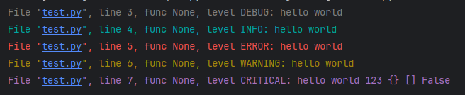

# LogAid

A log aid for you.

## Installation
```console
pip install logaid
```

## Usage 
### just print
```python
from logaid import log

log.info('hello world')
log.error('hello world')
log.warning('hello world')
log.fatal('hello world',123,{},[],False)
```

### open super print
```python
from logaid import log
log.init(print_pro=True)

print("Hello World")
```
### auto_save
```python
from logaid import log
log.init(level='DEBUG',save=True)

log.info('hello world')
```
### save as filename and not print
```python
from logaid import log
log.init(level='DEBUG',filename='cs.log',show=False)

log.info('hello world')
```
### define format
```python
from logaid import log
log.init(level='INFO',format='%(asctime)s %(levelname)s %(pathname)s %(lineno)d: %(message)s')

log.info('hello world')

```